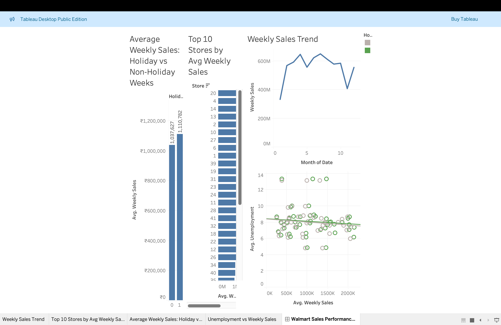

# 🏪 Walmart Sales Analysis Dashboard  

<p align="center">
  
</p>

### 📊 A Data Analyst Portfolio Project  

This end-to-end data analytics project explores **Walmart store sales performance** to uncover trends, seasonal patterns, and economic influences.

---

## 📁 Project Overview  

The project follows a real-world **data analysis workflow**, starting from raw data exploration to SQL queries and interactive dashboard visualization.

**Key Objectives:**
- Analyze Walmart’s store-level sales data  
- Identify top-performing stores  
- Compare sales during holiday vs non-holiday periods  
- Study relationships between unemployment and sales  
- Create a professional Tableau dashboard  

---

## 🧠 Tools & Technologies Used  

| Tool | Purpose |
|------|----------|
| **Python (Pandas, NumPy, Matplotlib)** | Data Cleaning & EDA |
| **MySQL** | Data Storage & SQL Queries |
| **Tableau Public** | Data Visualization & Dashboard |
| **GitHub** | Version Control & Portfolio Presentation |

---

## 🧹 Data Cleaning  

Performed using Python in Jupyter Notebook:
- Removed duplicates and nulls  
- Standardized date formats (`%d-%m-%Y`)  
- Converted categorical variables  
- Saved final dataset to `/data/processed/walmart_sales_clean.csv`

---

## 🧮 SQL Analysis  

Key business queries stored in `/sql/analysis_queries.sql`:

```sql
-- Top 10 Stores by Average Weekly Sales
SELECT Store, ROUND(AVG(Weekly_Sales),2) AS avg_weekly_sales
FROM sales_data
GROUP BY Store
ORDER BY avg_weekly_sales DESC
LIMIT 10;
```

Other analyses include:
- Total sales during holiday vs non-holiday weeks  
- Monthly average sales  
- Correlation between unemployment and weekly sales  
- Yearly performance by store  

---

## 📊 Tableau Dashboard  

Explore the interactive dashboard here:  
👉 [View on Tableau Public](https://public.tableau.com/views/YOUR_DASHBOARD_LINK_HERE)

### Key Insights  
- 🏪 **Store 20** consistently leads in average weekly sales  
- 🎉 **Holiday weeks** see ~20 % higher average sales  
- 📅 **Seasonal peaks** occur around November–December  
- 📉 **Slight negative correlation** between unemployment and sales  
- 💡 Clear evidence of store-level variation and seasonality  

---

## 📂 Project Structure  

```
walmart-sales-analysis/
├── data/
│   ├── raw/                     # Original dataset
│   └── processed/               # Cleaned data
├── notebooks/
│   ├── 01_data_exploration.ipynb
│   ├── 02_data_cleaning.ipynb
├── sql/
│   ├── schema.sql
│   ├── analysis_queries.sql
├── visuals/
│   ├── dashboard_screenshot.png
│   ├── walmart_sales_dashboard.twbx
├── README.md
```

---

## 📈 Results Summary  

| Metric | Insight |
|--------|----------|
| **Top Store** | Store 20 |
| **Holiday Effect** | +20 % boost in average weekly sales |
| **Seasonality** | November–December peaks |
| **Economic Trend** | Negative correlation with unemployment |

---

## 🧩 Tableau Workbook  

You can download and open the full Tableau workbook here:  
📁 [walmart_sales_dashboard.twbx](visuals/walmart_sales_dashboard.twbx)

*(Open in Tableau Public Desktop or Tableau Desktop to explore locally.)*

---

## 🙌 Acknowledgements  
- **Dataset:** [Walmart Store Sales Forecasting – Kaggle](https://www.kaggle.com/datasets/whenamancodes/walmart-sales-forecasting)  
- **Developed by:** *Your Name*  
- **Tools:** Python, SQL, Tableau, GitHub  

---

> 💡 *This project showcases data cleaning, SQL querying, and Tableau visualization — essential skills for a Data Analyst role.*